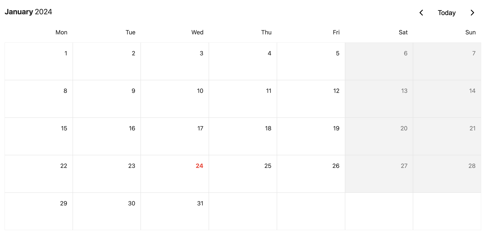

# Events app

- A full-stack event management via calendar view.

### Current status:

- Finish <u>stage 1</u>: a frontend with interactive calendar interface is developed.
- In <u>stage 2</u>: developing a feature to allow user to create and delete event from calendar view.

### Deployed version
- You can access the project by following this [link](https://oscar-event-site.onrender.com).
- The frontend, backend and database are deployed using render.com.
- Please access the deployed version with Chromium-based browsers like Chrome for best experience.
- !! Important: The backend is deployed with a free tier, so the initial load may take up to 2 minutes if it's waking up from sleep mode.
---

## Requirements / Purpose

- There will be 3 stages of MVPs:

  1. Create a frontend with interactive calendar interface.

     Reference to [Events Calendar](https://github.com/nology-tech/aus-post-course-guide/blob/main/projects/events-calendar)

  2. Create a feature to allow user to create and delete event from calendar view.

     Reference to [Events Creator Frontend](https://github.com/nology-tech/aus-post-course-guide/blob/main/projects/events-creator-frontend)

  3. Create backend to handle requests and manage event database.

     Reference to [Events Creator API](https://github.com/nology-tech/aus-post-course-guide/blob/main/projects/events-creator-api)

- Purpose of project
  - Create a functional calendar + event management app
  - Demonstrate the ability to create a full-stack web application with Spring Boot and Typescript

### Tech stack:

- Front end:

  - React
  - TypeScript

- Back end: (3rd stage)
  - Spring Boot
  - Java
  - Spring Data JPA (for connecting backend to database)
  - mySQL (database)

---

## Features: (when completed)

- Events are displayed and clickable in a form of calendar.
- With calendar, users can navigate between months and years.
- With events, users can VIEW, CREATE, EDIT, DELETE events.
- Inputs are validated.

---

## Screenshots

1. Calendar view

- 

---

## Change logs

### 10/2023 - Initiate frontend with vite (react) and typescript

### 01/2024 - Finish MVP1

An interactive calendar interface is working
